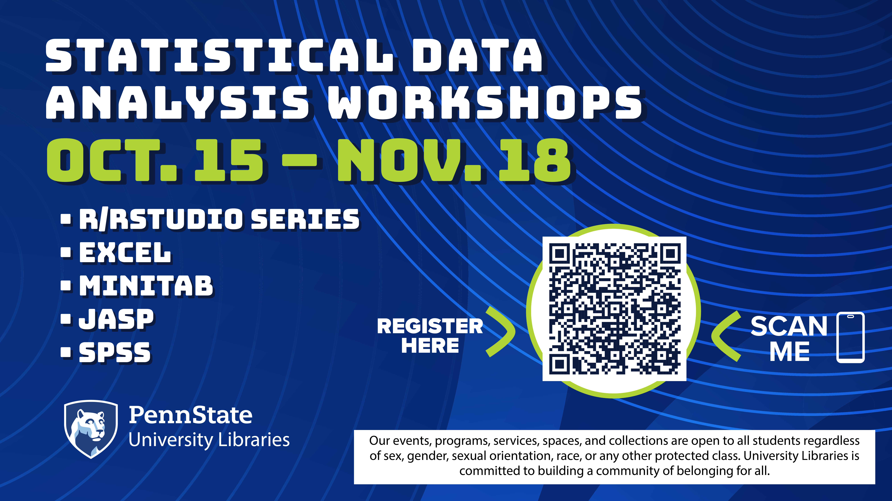

The Penn State University Libraries are hosting a series of workshops on statistical and data analysis packages:

## Introduction to Minitab — Oct. 23, 2–4 p.m.

This session will provide introductory knowledge on how to use Minitab for quantitative statistical analysis, with demonstrations using a practice dataset. Participants will learn how to access Minitab, navigate the software interface, input and transform data, specify variables, and conduct exploratory data analysis and some basic statistical tests. No previous Minitab experience is required.

Register for this session [here](https://psu.zoom.us/webinar/register/WN_Hdy_Xk-6QP6afSM3Hw1exg#/registration).

## Level Up Your R Skills: Functions & Reproducible Workflows (Postdocs only) — Nov. 12, 1–2:30 p.m.

For postdocs: Advance your R skills by writing functions, streamlining code, and structuring projects for reproducibility and collaboration.

Register for this session [here](https://forms.office.com/r/VAJYWDPZ2k).

## Introduction to JASP — Nov. 18, 2–4 p.m.

A beginner-friendly introduction to JASP. Learn how to run descriptive and basic statistical tests with practice datasets in this open-source alternative to SPSS.

Register for this session [here](https://psu.zoom.us/webinar/register/WN_oA7qjVYlRNaClokbWgstEQ#/registration).
